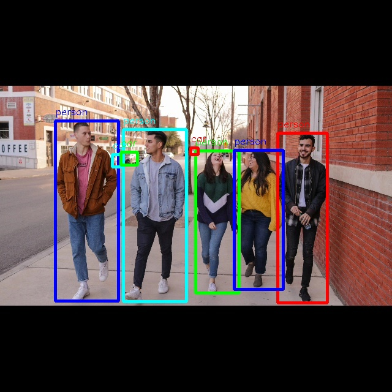
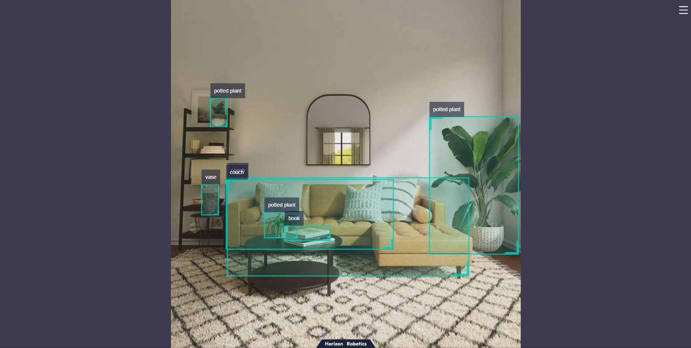
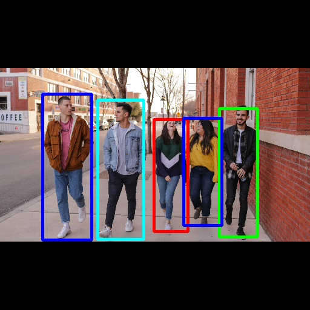
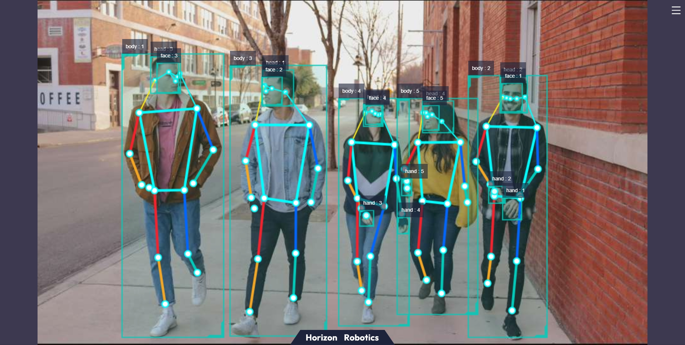
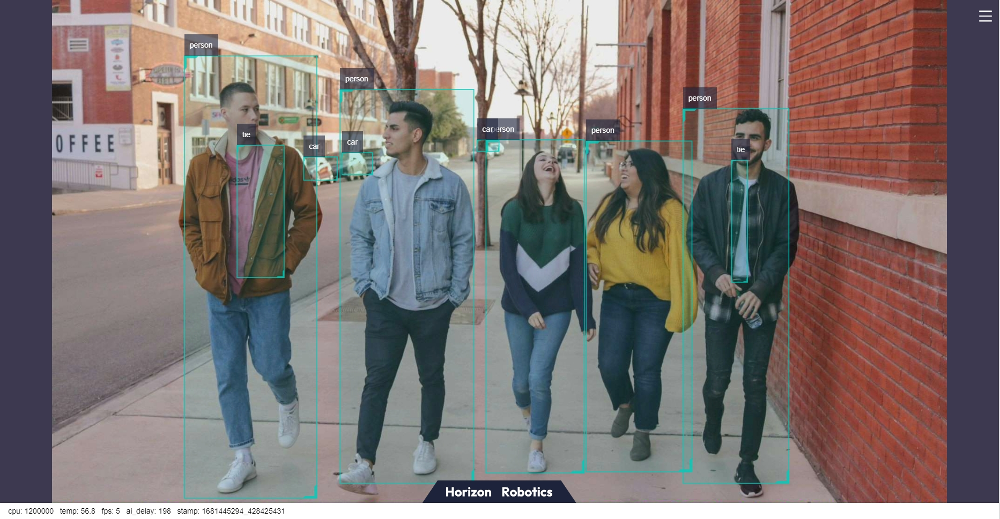

English| [简体中文](./README_cn.md)

Getting Started with Dnn Node Example
=======


# Feature Introduction

Dnn Node example package is a usage example of Dnn Node package. By inheriting the DnnNode virtual base class, it utilizes the BPU processor for model inference with model and image data. Image data can come from local image injection and subscribed image msg. By configuring the built-in post-processing algorithms in dnn_node, intelligent results are published in the post-processing of dnn node example, and the effects can be viewed through a web interface.

# Development Environment

- Programming Language: C/C++
- Development Platform: X3/Rdkultra/X5/X86
- System Version: Ubuntu 20.04/Ubuntu 22.04
- Compilation Toolchain: Linux GCC 9.3.0/Linaro GCC 11.4.0

# Compilation

- X3 Version: Supports compilation on the X3 Ubuntu system and cross-compilation using Docker on a PC.

- Rdkultra Version: Supports compilation on the Rdkultra Ubuntu system and cross-compilation using Docker on a PC.

- X5 Version: Supports compilation on the X5 Ubuntu system and cross-compilation using Docker on a PC.

- X86 Version: Supports compilation on the X86 Ubuntu system.

It also supports controlling the dependencies and functionality of the compiled pkg through compilation options.

## Dependency Libraries

- OpenCV: 3.4.5

ROS Packages:

- dnn node
- cv_bridge
- sensor_msgs
- hbm_img_msgs
- ai_msgs
- hobot_cv

hbm_img_msgs is a custom image message format used for image transmission in shared memory scenarios. The hbm_img_msgs pkg is defined in hobot_msgs; therefore, if shared memory is used for image transmission, this pkg is required.

## Compilation Options

1. SHARED_MEM

- Shared memory transmission switch, enabled by default (ON), can be turned off during compilation using the -DSHARED_MEM=OFF command.
- When enabled, compilation and execution depend on the hbm_img_msgs pkg and require the use of tros for compilation.
- When disabled, compilation and execution do not depend on the hbm_img_msgs pkg, supporting compilation using native ROS and tros.
- For shared memory communication, only subscription to nv12 format images is currently supported.## Compile on X3/Rdkultra Ubuntu System

1. Compilation Environment Verification

- The X3 Ubuntu system is installed on the board.
- The current compilation terminal has set up the TogetherROS environment variable: `source PATH/setup.bash`. Where PATH is the installation path of TogetherROS.
- The ROS2 compilation tool colcon is installed. If the installed ROS does not include the compilation tool colcon, it needs to be installed manually. Installation command for colcon: `pip install -U colcon-common-extensions`.
- The dnn node package has been compiled.

2. Compilation

- Compilation command: `colcon build --packages-select dnn_node_example`

## Docker Cross-Compilation for X3/Rdkultra Version

1. Compilation Environment Verification

- Compilation within docker, and TogetherROS has been installed in the docker environment. For instructions on docker installation, cross-compilation, TogetherROS compilation, and deployment, please refer to the README.md in the robot development platform's robot_dev_config repo.
- The dnn node package has been compiled.
- The hbm_img_msgs package has been compiled (see Dependency section for compilation methods).

2. Compilation

- Compilation command:

  ```shell
  # RDK X3
  bash robot_dev_config/build.sh -p X3 -s dnn_node_example

  # RDK Ultra
  bash robot_dev_config/build.sh -p Rdkultra -s dnn_node_example
  
  # RDK X5
  bash robot_dev_config/build.sh -p X5 -s dnn_node_example
  ```

- Shared memory communication method is enabled by default in the compilation options.

## Compile X86 Version on X86 Ubuntu System

1. Compilation Environment Verification

X86 Ubuntu version: ubuntu20.04

2. Compilation

- Compilation command:

  ```shell
  colcon build --packages-select dnn_node_example \
     --merge-install \
     --cmake-force-configure \
     --cmake-args \
     --no-warn-unused-cli \
     -DPLATFORM_X86=ON \
     -DTHIRD_PARTY=`pwd`/../sysroot_docker
  ```

## Notes


# Instructions

## Package Description
The source code contains the **dnn_node_example package**, which can be configured to use the post-processing algorithms built into the dnn_node. Currently, the dnn_node supports post-processing algorithms such as "yolov2," "yolov3," "yolov5," "yolov5x," "yolov8", "yolov10", "FasterRcnn", "mobilenetv2," "mobilenet_ssd," "efficient_det," "fcos," and "mobilenet_unet."

## Dependencies

- mipi_cam package: Publishes image messages
- websocket package: Renders images and AI perception messages

## Parameters

| Parameter Name      | Explanation                            | Mandatory            | Default Value       | Remarks                                                                 |
| ------------------- | -------------------------------------- | -------------------- | ------------------- | ----------------------------------------------------------------------- |
| feed_type           | Image source, 0: local; 1: subscribe   | No                   | 0                   |                                                                         |
| image               | Local image path                       | No                   | config/test.jpg     |                                                                         |
| image_type          | Image format, 0: bgr; 1: nv12          | No                   | 0                   |                                                                         |
| image_width         | Width of locally filled nv12 format image  | Must be set for nv12 format image | 0               |                                                                         |
| image_height        | Height of locally filled nv12 format image | Must be set for nv12 format image | 0               |                                                                         |
| is_shared_mem_sub   | Subscribe to images using shared memory communication method | No  | 0                   |                                                                         |
| config_file         | Path to the configuration file         | No                   | "config/fcosworkconfig.json" | Change the configuration file to use different models, default uses FCOS model |
| dump_render_img     | Whether to render, 0: no; 1: yes       | No                   | 0                   |                                                                         |
| msg_pub_topic_name  | Topic name for publishing intelligent results for web display | No | hobot_dnn_detection |                                                                      |
| ros_img_topic_name | Subscribe to the topic name of an Image message of type sensor_msgs::msg::Image | 否                   | /image |                                                                         |
| sharedmem_img_topic_name | Subscribe to the topic name of the hbm_img_msgs::msg::HbmMsg1080P type image message | 否                   | /hbmem_img |                                                                         |

## Running

- The models used by dnn_node_example are already installed during tros.b installation. The RDK X3 is installed in `/opt/hobot/model/x3/basic`, the RDK Ultra is installed in `/opt/hobot/model/rdkultra/basic/`, and the RDK X5 is installed in `/opt/hobot/model/x5/basic/` after a successful build. 

- After compilation, copy the generated install path to the Horizon RDK (if compiling on the RDK, skip the copying step) and run the following command.

## Running on X3 Ubuntu System

Running method 1, use the executable file to start:
```shell
export COLCON_CURRENT_PREFIX=./install
source ./install/local_setup.bash
# The config includes models used by the example and local images for filling
# Copy based on the actual installation path (the installation path in the docker is install/lib/dnn_node_example/config/, the copy command is cp -r install/lib/dnn_node_example/config/ .).
cp -r install/dnn_node_example/lib/dnn_node_example/config/ .

# Run mode 1:To use the yolov3 model and the yolov3 post-processing algorithm built into dnn_node, configure to perform inference in synchronous mode using a local jpg format image and store the rendered image:


ros2 run dnn_node_example example --ros-args -p feed_type:=0 -p image:=config/test.jpg -p image_type:=0 -p dump_render_img:=1 -p config_file:=config/yolov3workconfig.json

# Run mode 2:Configure to use the yolov2 model and the yolov2 post-processing algorithm built into dnn_node, perform inference in asynchronous mode using the subscribed image message (topic is /image_raw), and set the log level to warn:

ros2 run dnn_node_example example --ros-args -p feed_type:=1 --ros-args --log-level warn -p config_file:=config/yolov2workconfig.json

# Run mode 3: Use shared memory communication method (topic is /hbmem_img) to perform inference in asynchronous mode and set the log level to warn:

ros2 run dnn_node_example example --ros-args -p feed_type:=1 -p is_shared_mem_sub:=1 --ros-args --log-level warn
```

To run in mode 2 using a launch file:

```shell
export COLCON_CURRENT_PREFIX=./install
source ./install/setup.bash
# Copy the configuration based on the actual installation path
cp -r install/lib/dnn_node_example/config/ .

# Configure MIPI camera
export CAM_TYPE=mipi

# Start the launch file, publish nv12 format images using shared memory with F37 sensor
# By default, it runs the fcos algorithm, switch algorithms using the config_file parameter in the launch command, e.g., to use unet algorithm: config_file:="config/mobilenet_unet_workconfig.json"
ros2 launch dnn_node_example dnn_node_example.launch.py
```

## Run on X3 Yocto system:

```shell
export ROS_LOG_DIR=/userdata/
export LD_LIBRARY_PATH=${LD_LIBRARY_PATH}:./install/lib/

# Copy the configuration used by the example and the local image used for inference
cp -r install/lib/dnn_node_example/config/ .

# Run mode 1: Perform inference in synchronous mode using a local jpg format image and store the rendered image
./install/lib/dnn_node_example/example --ros-args -p  feed_type:=0 -p image:=config/test.jpg -p image_type:=0 -p dump_render_img:=1

# Run mode 2: Perform inference in asynchronous mode using the subscribed image message (topic is /image_raw) and set log level to warn
./install/lib/dnn_node_example/example --ros-args -p feed_type:=1 --log-level warn

# Run mode 3: Perform inference in asynchronous mode using shared memory communication (topic is /hbmem_img) and set log level to warn
./install/lib/dnn_node_example/example --ros-args -p feed_type:=1 -p is_shared_mem_sub:=1 --ros-args --log-level warn
```

## Run on X86 Ubuntu system:

```shell
export COLCON_CURRENT_PREFIX=./install
source ./install/setup.bash
# Copy the model used in the config as an example, adjust based on the actual installation path
cp -r ./install/lib/dnn_node_example/config/ .

# Launch the file using feedback mode
# By default, the FCOS algorithm will run. To switch algorithms using the config_file parameter, for example, to use the UNet algorithm: config_file:="config/mobilenet_unet_workconfig.json"
ros2 launch dnn_node_example dnn_node_example_feedback.launch.py
```

## Running on Rdkultra Ubuntu System

```shell
export COLCON_CURRENT_PREFIX=install
source install/setup.bash

# Launch using feedback mode and switch algorithms using config_file parameter
ros2 launch dnn_node_example dnn_node_example_feedback.launch.py dnn_example_config_file:=config/mobilenetv2workconfig.json dnn_example_image:=config/target_class.jpg

# Using MIPI camera as input for image data and switch algorithms using config_file parameter
export CAM_TYPE=usb
ros2 launch dnn_node_example dnn_node_example.launch.py dnn_example_config_file:=config/mobilenetv2workconfig.json

```

## Notes

- The config_file configuration file format is JSON. Here is an example configuration for the YOLOv5 model:

```json
{
  "model_file": "/opt/hobot/model/x3/basic/yolov5_672x672_nv12.bin",
  "dnn_Parser": "yolov5",
  "model_output_count": 3,
  "class_num": 80,
  "cls_names_list": "config/coco.list",
  "strides": [8, 16, 32],
  "anchors_table": [[[10, 13], [16, 30], [33, 23]], [[30, 61], [62, 45], [59, 119]], [[116, 90], [156, 198], [373, 326]]],
  "score_threshold": 0.4,
  "nms_threshold": 0.5,
  "nms_top_k": 5000
}
```

  "model_file" indicates the path to the model file.
  Models currently supported by the example:
  | Model Name                            | Model Type | Platform Support | Model Output Description                 | Rendering Effect                       |
  | -------------------------------------- | ---------- | ---------------- | ---------------------------------------- | --------------------------------------- |
  | yolov2_608x608_nv12                    | Detection Model | x3/x86 | Output objects detected and bounding boxes |          |
  | yolov3_416x416_nv12                    | Detection model | x3/x86 | Output detected objects and bounding boxes |         |
  | yolov5_672x672_nv12                    | Detection model | x3 | Output detected objects and bounding boxes |         |
  | yolov5x_672x672_nv12                   | Detection model | Rdkultra | Output detected objects and bounding boxes |         |
  | yolov8_416x416_nv12                    | Detection model | x3/x5/x86 | Output detected objects and bounding boxes |         |
  | yolov10_416x416_nv12                   | Detection model | x3/x5/x86 | Output detected objects and bounding boxes |        |
  | mobilenet_ssd_300x300_nv12             | Detection model | x3/x86 | Output detected objects and bounding boxes |  |
  | fcos_512x512_nv12                      | Detection model | x3/x86 | Output detected objects and bounding boxes |           |
  | efficient_det_no_dequanti_512x512_nv12 | Detection model | x3 | Output detected objects and bounding boxes |  |
  | multitask_body_kps_960x544.hbm         | Detection model | x3/x86 | Output detected body bounding boxes and human keypoint indices |       |
  | mobilenetv2_224x224_nv12.bin           | Classification model | x3/x86 | Output the class result with the highest confidence |    |
  | mobilenet_unet_1024x2048_nv12.bin      | Segmentation model | x3/x86 | Semantic segmentation, output image with each pixel corresponding to its class |           |

"dnn_Parser" setting chooses the built-in post-processing algorithm, currently support configurations include `"yolov2", "yolov3", "yolov5", "yolov5x", "yolov8", "yolov10", "kps_parser", "classification", "ssd", "efficient_det", "fcos", "unet"`.
"model_output_count" represents the number of model output branches.

- Segmentation model algorithm currently only supports local image feedback and does not have web display functionality.

# Results Analysis

## X3 Results Display

log:

Command executed: `ros2 run dnn_node_example example --ros-args -p config_file:=config/yolov3workconfig.json -p dump_render_img:=1`

```
[WARN] [1684542863.055571066] [example]: This is dnn node example!
[WARN] [1684542863.133229900] [example]: Parameter:
 feed_type(0:local, 1:sub): 0
 image: config/test.jpg
 image_type: 0
 dump_render_img: 1
 is_shared_mem_sub: 0
 model_file_name:  /app/model/basic/yolov3_416x416_nv12.bin
[INFO] [1684542863.149125191] [dnn]: Node init.
[INFO] [1684542863.149228733] [example]: Set node para.
[INFO] [1684542863.149285441] [dnn]: Model init.
[BPU_PLAT]BPU Platform Version(1.3.1)!
[HBRT] set log level as 0. version = 3.13.27
[DNN] Runtime version = 1.8.4_(3.13.27 HBRT)
[HorizonRT] The model builder version = 1.6.8
[000:000] (model.cpp:244): Empty desc, model name: yolov3_416x416_nv12, input branch:0, input name:data
[000:000] (model.cpp:313): Empty desc, model name: yolov3_416x416_nv12, output branch:0, output name:layer82-conv-transposed
[000:000] (model.cpp:313): Empty desc, model name: yolov3_416x416_nv12, output branch:1, output name:layer94-conv-transposed
[000:000] (model.cpp:313): Empty desc, model name: yolov3_416x416_nv12, output branch:2, output name:layer106-conv-transposed
[INFO] [1684542864.119252525] [dnn]: The model input 0 width is 416 and height is 416
[INFO] [1684542864.119363442] [example]: Set output parser.
[INFO] [1684542864.119542525] [dnn]: Task init.
[INFO] [1684542864.121412067] [dnn]: Set task_num [2]
[INFO] [1684542864.121486859] [example]: The model input width is 416 and height is 416
[INFO] [1684542864.121529775] [example]: Dnn node feed with local image: config/test.jpg
```[INFO] [1684542866.023484026] [example]: task_num: 2
[INFO] [1684542866.200993943] [Yolo3Darknet_detection_parser]: dep out size: 3 3
[INFO] [1684542866.319497818] [example]: Output from image_name: config/test.jpg, frame_id: , stamp: 0.0
[INFO] [1684542866.319713068] [PostProcessBase]: outputs size: 3
[INFO] [1684542866.319767526] [PostProcessBase]: out box size: 11
[INFO] [1684542866.319839151] [PostProcessBase]: det rect: 300.004 68.3111 347.666 415, det type: person, score:0.999796
[INFO] [1684542866.319934693] [PostProcessBase]: det rect: 248.503 104.931 300.809 397.489, det type: person, score:0.999763
[INFO] [1684542866.320014818] [PostProcessBase]: det rect: 62.517 53.741 123.072 414.076, det type: person, score:0.999734
[INFO] [1684542866.320092193] [PostProcessBase]: det rect: 202.355 108.962 251.666 396.325, det type: person, score:0.999712
[INFO] [1684542866.320165276] [PostProcessBase]: det rect: 132.448 70.7646 196.075 415, det type: person, score:0.999361
[INFO] [1684542866.320286360] [PostProcessBase]: det rect: 117.439 129.264 130.877 152.227, det type: car, score:0.940759
[INFO] [1684542866.320360610] [PostProcessBase]: det rect: 201.869 117.786 210.163 130.43, det type: car, score:0.914081
[INFO] [1684542866.320433443] [PostProcessBase]: det rect: 125.557 124.45 149.921 149.43, det type: car, score:0.81808
[INFO] [1684542866.320505526] [PostProcessBase]: det rect: 173.927 125.132 184.199 136.716, det type: car, score:0.811718
[INFO] [1684542866.320589943] [PostProcessBase]: det rect: 143.016 121.023 156.819 143.535, det type: car, score:0.451065
[INFO] [1684542866.320663485] [PostProcessBase]: det rect: 235.168 120.715 242.281 131.487, det type: car, score:0.406651
[INFO] [1684542866.324350193] [ImageUtils]: target size: 11
[INFO] [1684542866.324494110] [ImageUtils]: target.rois.size: 1
[INFO] [1684542866.324536068] [ImageUtils]: roi.type:
[INFO] [1684542866.324574110] [ImageUtils]: roi x_offset: 300 y_offset: 68 width: 47 height: 346
[INFO] [1684542866.325962026] [ImageUtils]: target.rois.size: 1
[INFO] [1684542866.326007568] [ImageUtils]: roi.type:
[INFO] [1684542866.326044610] [ImageUtils]: roi x_offset: 248 y_offset: 104 width: 52 height: 292
[INFO] [1684542866.326231151] [ImageUtils]: target.rois.size: 1
[INFO] [1684542866.326270651] [ImageUtils]: roi.type:
[INFO] [1684542866.326306860] [ImageUtils]: roi x_offset: 62 y_offset: 53 width: 60 height: 360
[INFO] [1684542866.326534235] [ImageUtils]: target.rois.size: 1
[INFO] [1684542866.326573651] [ImageUtils]: roi.type:
[INFO] [1684542866.326609818] [ImageUtils]: roi x_offset: 202 y_offset: 108 width: 49 height: 287
[INFO] [1684542866.326794193] [ImageUtils]: target.rois.size: 1
[INFO] [1684542866.326833235] [ImageUtils]: roi.type:
[INFO] [1684542866.326868985] [ImageUtils]: roi x_offset: 132 y_offset: 70 width: 63 height: 344
[INFO] [1684542866.327076401] [ImageUtils]: target.rois.size: 1
[INFO] [1684542866.327115526] [ImageUtils]: roi.type:
[INFO] [1684542866.327151735] [ImageUtils]: roi x_offset: 117 y_offset: 129 width: 13 height: 22
[INFO] [1684542866.327214526] [ImageUtils]: target.rois.size: 1
[INFO] [1684542866.327252235] [ImageUtils]: roi.type:
[INFO] [1684542866.327374943] [ImageUtils]: roi x_offset: 201 y_offset: 117 width: 8 height: 12
[INFO] [1684542866.327435901] [ImageUtils]: target.rois.size: 1
[INFO] [1684542866.327473651] [ImageUtils]: roi.type:
[INFO] [1684542866.327509360] [ImageUtils]: roi x_offset: 125 y_offset: 124 width: 24 height: 24
[INFO] [1684542866.327573818] [ImageUtils]: target.rois.size: 1
[INFO] [1684542866.327611401] [ImageUtils]: roi.type:
[INFO] [1684542866.327647193] [ImageUtils]: roi x_offset: 173 y_offset: 125 width: 10 height: 11
[INFO] [1684542866.327704818] [ImageUtils]: target.rois.size: 1
[INFO] [1684542866.327742026] [ImageUtils]: roi.type:
[INFO] [1684542866.327777318] [ImageUtils]: roi x_offset: 143 y_offset: 121 width: 13 height: 22
[INFO] [1684542866.327839360] [ImageUtils]: target.rois.size: 1
[INFO] [1684542866.365547943] [ImageUtils]: roi.type:
[INFO] [1684542866.365588651] [ImageUtils]: roi x_offset: 235 y_offset: 120 width: 7 height: 10[WARN] [1684542866.365663276] [ImageUtils]: Draw result to file: render__0_0.jpeg
[WARN] [1684542866.386982151] [example]: Smart fps = 1

```

Rendered image: 

## Web demonstration
The web demonstration uses the model detection results of yolov2. The startup process is as follows:

```shell
# 1 Start the image publishing node:
ros2 run mipi_cam mipi_cam --ros-args -p out_format:=nv12 -p image_width:=608 -p image_height:=608 -p io_method:=shared_mem --log-level error &

# 2 Start the jpeg image encoding & publishing package
ros2 run hobot_codec hobot_codec_republish --ros-args -p channel:=1 -p in_mode:=shared_mem -p in_format:=nv12 -p out_mode:=ros -p out_format:=jpeg -p sub_topic:=/hbmem_img -p pub_topic:=/image_jpeg --ros-args --log-level error &

# 3 Start the web display package
ros2 run websocket websocket --ros-args -p image_topic:=/image_jpeg -p image_type:=mjpeg -p smart_topic:=/hobot_dnn_detection --log-level error &

# 4 Start the dnn_node_example using asynchronous image loading method to subscribe
ros2 run dnn_node_example example --ros-args -p feed_type:=1 -p is_shared_mem_sub:=1 -p msg_pub_topic_name:=hobot_dnn_detection -p config_file:=config/yolov2workconfig.json
```

Screenshot of the web demonstration:
